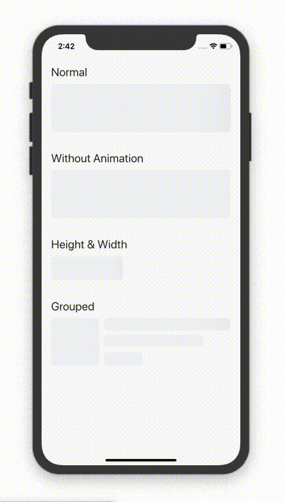

# Content Placeholder


A fluter plugin to make nice animated shimmer content placeholders. This plugin uses [shimmer](https://pub.dev/packages/shimmer) flutter plugin for shimmer animation.

## How To Use

```dart
ContentPlaceholder();
```
  
## Getting Started
See the [example](example) directory for a complete sample app.



## Changelog

Refer to the [Changelog](CHANGELOG.md) to get all release notes.

## Issues & Feedback

Please file issues, bugs, or feature requests in the repository issue tracker.

Contributions are welcome 😊❤️